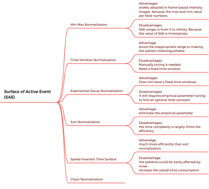

# Efficient Spatial-Temporal Normalization of SAE Representation for Event Camera

IEEE-RAL 2020

## Research Question: 
	How to design a highly efficient normalization method for SAE?
Surface of active event (SAE) is an effective representation of events. However, SAE previous works apply normalizations as an essential preprocessing step to extract time-invariant features from SAEs. These normalization methods have drawbacks, e.g., requiring parameter tuning. 

## Summary:
	Two stages are taken to generate HATS. A local memory time surface is first created using previously recorded events. The HATS is then produced by applying a regularization strategy to that surface in both a spatial and a temporal manner.
SAE is obtained by using the timestamp of the latest activated event in each pixel, resulting in an effective spatial-temporal representation of events.

## Main Contributions:
	Their implementation can efficiently capture the spatial and temporal relationships of events and enable further robust normalization.
	They increase the efficiency in local tasks by using a novel stacking strategy.

## Motivation: 
The ideal normalization method should be not only parameter-free but also be able to cope with any size of SAE efficiently in both the on-demand and asynchronous cases.

## Challenges:
	Learning a meaningful data distribution to represent patterns directly from an SAE is still a challenging task because patterns in an SAE are presented in a spatial-temporal domain using the timestamps of events.
## Method Details:
	They design a new data structure with O(1) time complexity to update and maintain events in a doubly-linked list.

## Experiments:
	This table shows the performance of different representations on classification problems.
 
## Weaknesses:
1.	This paper only considers the performance on classification tasks and does not consider the performance on some other tasks, such as depth estimation. 
The requirements for the representation of events vary depending on the task.

